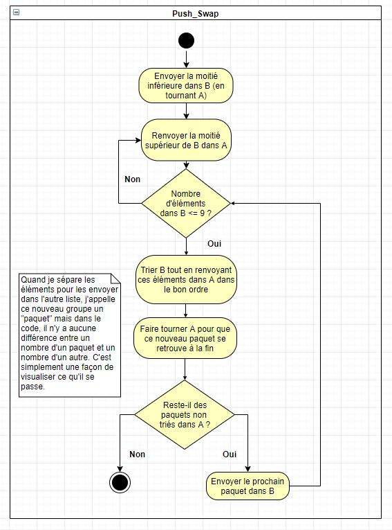
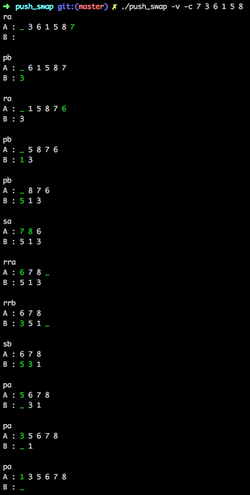

# push_swap

## Sujet :

Le but de ce projet est de trier en moins de coup possible une liste de nombre. Pour cela, on a droit d'utiliser 2 listes
et les instructions suivantes :
* sa : Echange les premier et second éléments de la liste A
* sb : Echange les premier et second éléments de la liste B
* ss : Echange les premier et second éléments des listes A et B (indépendamment l'une de l'autre)
* ra : "Tourne" la liste A au sens horaire en envoyant son premier élément à la fin.
* rb : "Tourne" la liste B au sens horaire en envoyant son premier élément à la fin.
* rr : "Tourne" les deuxlistes au sens horaire en envoyant leur premier élément à la fin.
* rra : "Tourne" la liste A au sens anti-horaire en envoyant son premier élément à la fin.
* rrb : "Tourne" la liste B au sens anti-horaire en envoyant son premier élément à la fin.
* rrr : "Tourne" les deuxlistes au sens anti-horaire en envoyant leur premier élément à la fin.
* pa : Envoit le premier élément de B au début de A
* pb : Envoit le premier élément de A au début de B

Nous devions aussi créer un petit programme "Checker" qui vérifie que la liste d'instructions fournit par push_swap trie effectivement la liste de nombre spécifiée.

## Mon implémentation :

On se retrouve à la fin avec A contenant des paquest triés de N (< 9) élément par odre croissant.
Tout au long de ce processus, il y a quelques améliorations permettant d'être plus efficace, tout comme le fait de trier B tout en renvoyant des éléments dans A. Quand je parcoure une liste, si je tombe sur le prochain nombre désiré, je l'envoies directement là où il faut pour gagner du temps.

Mon programme fait encore des mouvements inutile par moment, pour parer à cela, j'aurais pu parcourir la liste de toutes mes instructions et remplacer les redondances ou les actions s'annulant.

Prenons en exemple une liste avec les nombres de 0 à 100. Le symbole "!" signifie "trié" et le symbole "#" non-trié.
J'ai sauté les étapes répétives.

A : [0 - 99 #]  
B :
-  -  -  -  -  -  -  -  -  -  -  -  -  -  -  -  -  -  -  -  - 
A : [50 - 99 #]  
B : [0 - 49 #]
-  -  -  -  -  -  -  -  -  -  -  -  -  -  -  -  -  -  -  -  - 
A : [25 - 49 #] [50 - 100 #]  
B : [0 - 24 #]
-  -  -  -  -  -  -  -  -  -  -  -  -  -  -  -  -  -  -  -  - 
A : [6 - 11 #] [12 - 24 #] [25 - 49 #] [50 - 100 #]  
B : [0 - 5 #]
-  -  -  -  -  -  -  -  -  -  -  -  -  -  -  -  -  -  -  -  - 
A : [6 - 11 #] [12 - 24 #] [25 - 49 #] [50 - 100 #]  
B : [0 - 5 !]
-  -  -  -  -  -  -  -  -  -  -  -  -  -  -  -  -  -  -  -  - 
A : [0 - 5 !] [6 - 11 #] [12 - 24 #] [25 - 49 #] [50 - 100 #]  
B : 
-  -  -  -  -  -  -  -  -  -  -  -  -  -  -  -  -  -  -  -  - 
A : [6 - 11 #] [12 - 24 #] [25 - 49 #] [50 - 100 #][0 - 5 !]  
B : 
-  -  -  -  -  -  -  -  -  -  -  -  -  -  -  -  -  -  -  -  - 
A : [0 - 5 !] [6 - 11 !] [12 - 18 !] [19 - 24 !] [25 - 37 !] [38 - 49 !] [50 - 56 !]
 [57 - 62 !] [63 - 69 !] [70 - 75 !] [76 - 82 !] [83 - 87 !] [88 - 94 !] [95 - 99 !]  
B :  

## Visualisation :
J'ai fait une visualisation simple montrant le contenu des deux listes (avec une ellipse si elles sont trop grandes) et le dernier mouvement en couleur.

